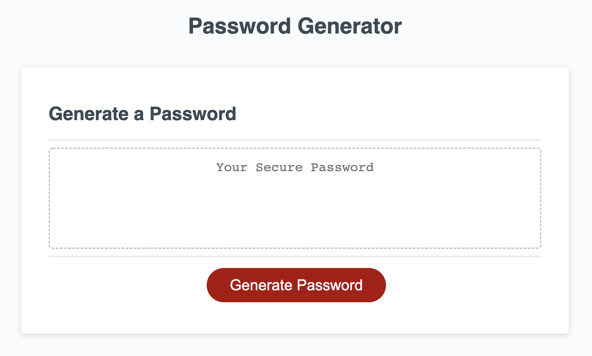
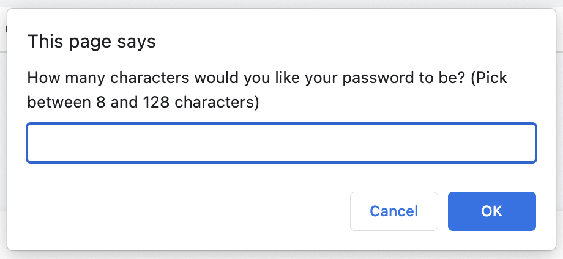

## PasswordGenerator
With this application, a password with a length between 8 and 128 characters will be randomly generated for a user based on user-selected password criteria. 

## User Story
AS AN employee with access to sensitive data
I WANT to randomly generate a password that meets certain criteria
SO THAT I can create a strong password that provides greater security

## Description
This is a Password Generator application which prompts the user to specify criteria for generating a random password. 
Upon clicking the Generate Password button, the user is requested to input the desired number of characters between 8 and 128. If the input is not an integer between 8 and 128, the user is notified through a prompt which, upon clicking OK, returns the user to the initial prompt without the need to refresh the application.  
After inputting the desired number of characters, the user is then asked, through a series of window prompts, for criteria to be included in the randomly generated password, which include: lowercase letters, uppercase letters, numbers, as well as an array of special characters approved by the OWASP Foundation. 
Once the user is done clicking through the criteria prompts, a randomly generated password is presented on the screen. 

## Screenshot of Deployed Application
Screenshot showing what the user will see upon deploying application

Screenshot showing Initial Prompt when user clicks Generate Password button

## Link to Deployed Application
https://fwinkler3.github.io/PasswordGenerator/ 

## Contact
Frank Winkler III
GitHub: https://github.com/FWinkler3
Email: frank.w.winkler@gmail.com